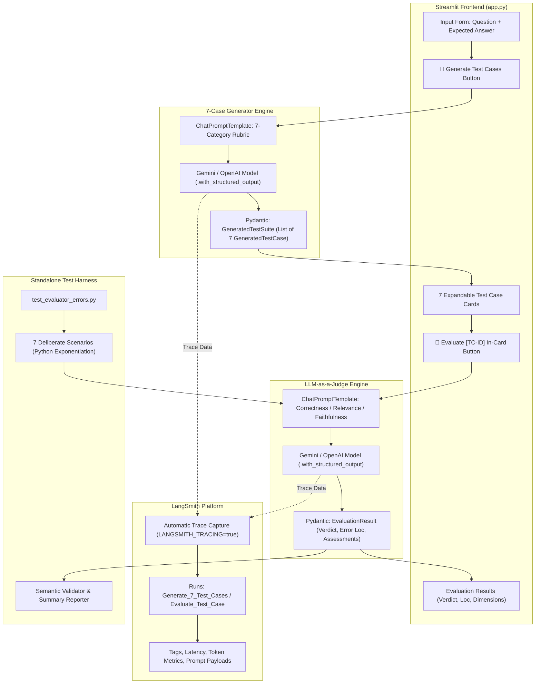

# 📘 LangSmith Evaluator Agent — Complete Working & Architecture Guide

A comprehensive, beginner-to-advanced technical deep dive into the **LangSmith Evaluator Agent** codebase, architecture, LLM-as-a-Judge evaluation engine, LangSmith observability, structured test generation, and technical interview preparation.

---

## 📑 Table of Contents
1. [Project Overview](#1-project-overview)
2. [System Architecture & Data Flow](#2-system-architecture--data-flow)
3. [End-to-End Execution Workflow](#3-end-to-end-execution-workflow)
4. [The 7 Structured Test Case Categories](#4-the-7-structured-test-case-categories)
5. [Deep Codebase Walkthrough (`app.py`)](#5-deep-codebase-walkthrough-apppy)
6. [Evaluation Logic & LLM-as-a-Judge Mechanics](#6-evaluation-logic--llm-as-a-judge-mechanics)
7. [Automated Validation Harness (`test_evaluator_errors.py`)](#7-automated-validation-harness-test_evaluator_errorspy)
8. [LangSmith Observability & Tracing](#8-langsmith-observability--tracing)
9. [Step-by-Step Example Execution Walkthrough](#9-step-by-step-example-execution-walkthrough)
10. [Project Limitations & Engineering Improvements](#10-project-limitations--engineering-improvements)
11. [Comprehensive Interview Preparation Guide](#11-comprehensive-interview-preparation-guide)
12. [Concise README-Ready Workflow Summary](#12-concise-readme-ready-workflow-summary)

---

## 1. Project Overview

### 1.1 What is the LangSmith Evaluator Agent?
The **LangSmith Evaluator Agent** is an automated quality assurance and evaluation platform for Large Language Model (LLM) applications. Given any **Question** and a trusted ground-truth **Expected Answer**, it:
1. **Generates exactly 7 structured test cases** spanning the entire spectrum of AI answer quality (from fully correct to subtly misleading).
2. **Performs automated LLM-as-a-Judge evaluation** comparing simulated AI answers against the reference ground truth across three core dimensions: **Correctness**, **Relevance**, and **Faithfulness**.
3. **Pinpoints exact error locations** (extracting the verbatim faulty phrase or identifying specific missing concepts).
4. **Logs complete tracing telemetry to LangSmith** for full production observability (token usage, execution latency, metadata tags, and prompt-completion inspection).

### 1.2 What Problem Does It Solve?
Evaluating LLM-generated text using traditional unit tests or string matching fails because language models produce non-deterministic, semantically equivalent answers. For example:
- *Reference Answer:* "The output is 8 because `**` is the exponentiation operator."
- *Model Output:* "Evaluating `2 ** 3` in Python yields 8 (2 raised to the power 3)."

Traditional assertions (`assert output == expected`) fail on valid paraphrases, while regex rules are brittle. Conversely, subtle hallucinations (e.g., claiming `2 ** 3` causes a syntax error) might slip past simple keyword checks. 

This agent solves these challenges by applying structured **LLM-as-a-Judge** evaluation combined with schema validation to evaluate semantic truth rather than superficial syntax.

### 1.3 Why is an LLM Evaluator Needed?
| Dimension | Traditional Unit Testing | LLM-as-a-Judge Evaluator |
| :--- | :--- | :--- |
| **Paraphrasing & Synonyms** | ❌ Fails (string mismatch) | ✅ Passes (semantic equivalence) |
| **Partial Completeness** | ❌ Hard to quantify | ✅ Identifies specific missing concepts |
| **Hallucination Detection** | ❌ Impossible with regex | ✅ Pinpoints contradictory or unverified claims |
| **Conciseness vs Verbosity** | ❌ Penalizes different length | ✅ Evaluates core factual correctness |

### 1.4 How is This Different from a Normal Chatbot?
- A **Chatbot** is an open-ended conversational generator that takes a prompt and produces text without verifying truth or adhering to strict grading schemas.
- An **Evaluator Agent** acts as an objective, constrained arbiter. It takes a ground truth reference, strictly validates candidate answers against that reference, enforces Pydantic schemas, identifies error coordinates, and records traces in an observability dashboard.

### 1.5 Technology Stack
- **Python 3.10+ / 3.11**: Core runtime.
- **LangChain (`langchain`, `langchain-core`)**: Orchestrates prompt templates, chain composition (`RunnableSequence` via `|`), and LLM invocation.
- **Google Generative AI (`langchain-google-genai`)**: Primary LLM engine using `gemini-3.1-flash-lite` for high-speed, cost-effective structured evaluation.
- **OpenAI (`langchain-openai`)**: Alternative provider support (`gpt-4o-mini`, `gpt-4o`).
- **Pydantic v2 (`pydantic`)**: Enforces strict data models (`GeneratedTestSuite`, `EvaluationResult`, `VerdictEnum`) and guarantees type safety via JSON Schema validation.
- **LangSmith (`langsmith`)**: Captures run traces, execution graphs, latency, token consumption, and metadata tags.
- **Streamlit (`streamlit`)**: Provides a reactive, card-based web dashboard without heavy frontend boilerplate.
- **Python-Dotenv (`python-dotenv`)**: Securely loads environment variables (`.env`).

---

## 2. System Architecture & Data Flow



---

## 3. End-to-End Execution Workflow

### Step-by-Step Flow:
1. **Input Submission**: The user enters a `Question` and an `Expected Answer` on the Streamlit interface and clicks **🚀 Generate Test Cases**.
2. **Validation**: Streamlit checks that neither field is empty and ensures an API key is available in `.env` or the sidebar.
3. **Chain Invocation**: `run_generation()` invokes `get_generator_chain()`:
   - Formulates a system prompt commanding the model to produce **exactly 7 distinct categories**.
   - Pipes the prompt into `llm.with_structured_output(GeneratedTestSuite)`.
4. **Structured Parsing**: Pydantic validates the response against `GeneratedTestSuite`, ensuring 7 instances of `GeneratedTestCase` with fields like `test_case_id`, `sample_answer`, `expected_verdict`, and `error_location`.
5. **Card Rendering**: Streamlit renders 7 expandable cards with color-coded status badges (`🟢 PASS`, `🟡 PARTIAL`, `🔴 FAIL`, `🟢 NO ERROR`, `🔴 ERROR`).
6. **In-Card Evaluation**: The user clicks **🚀 Evaluate TC-XXX** inside any individual card.
7. **Judge Invocation**: `run_evaluation()` passes `question`, `reference_answer`, and `sample_answer` to `get_evaluator_chain()`:
   - System prompt defines criteria for **Correctness**, **Relevance**, and **Faithfulness**.
   - Model returns an `EvaluationResult` containing the actual verdict, dimensional assessments, exact error location, and improvement tips.
8. **Comparison & Alignment**: Streamlit compares the evaluator's actual verdict against the test case's expected verdict, rendering an alignment badge (`✅ Matches Expected Verdict` or `⚠️ Verdict Diverged`).
9. **Observability**: LangSmith captures the complete execution trace, including exact input prompt tokens, output JSON, execution duration, and metadata tags (`test-case-generator`, `evaluator-agent`, `TC-001`, etc.).

---

## 4. The 7 Structured Test Case Categories

The generator produces exactly one test case per category to test the evaluator's boundaries:

| # | Category | Expected Verdict | Error Status | Standard Error Location | Description & Example |
| :---: | :--- | :---: | :---: | :--- | :--- |
| **TC-001** | `CORRECT` | 🟢 **PASS** | 🟢 **NO ERROR** | `None` | **Fully correct, direct answer.**<br>*Example:* "The output is 8 because `**` is the exponentiation operator in Python." |
| **TC-002** | `CORRECT PARAPHRASED` | 🟢 **PASS** | 🟢 **NO ERROR** | `None` | **Semantically accurate with alternative wording.**<br>*Example:* "Evaluating `2 ** 3` computes 2 cubed, resulting in 8." |
| **TC-003** | `PARTIALLY CORRECT` | 🟡 **PARTIAL** | 🔴 **ERROR** | Exact flawed phrase | **Contains factual truths with a minor flaw.**<br>*Example:* "The output is 8, which is computed by multiplying 2 by 3." |
| **TC-004** | `INCOMPLETE` | 🟡 **PARTIAL** | 🔴 **ERROR** | `Missing details: [...]` | **Omits crucial core concepts or output.**<br>*Example:* "The `**` operator represents exponentiation in Python." (Omits the value 8). |
| **TC-005** | `WRONG` | 🔴 **FAIL** | 🔴 **ERROR** | Quoted incorrect text | **Contains a blatant factual or technical error.**<br>*Example:* "The output is 6 because `**` multiplies 2 by 3." |
| **TC-006** | `IRRELEVANT` | 🔴 **FAIL** | 🔴 **ERROR** | `Entire answer.` | **Discusses an unrelated topic or misses the prompt.**<br>*Example:* "Python was created by Guido van Rossum in 1991." |
| **TC-007** | `MISLEADING` | 🔴 **FAIL** / 🟡 **PARTIAL** | 🔴 **ERROR** | Quoted false claim | **Blends truth with a false/contradictory claim.**<br>*Example:* "The output is 8, but this syntax is deprecated and triggers a syntax error in Python 3." |

---

## 5. Deep Codebase Walkthrough (`app.py`)

### 5.1 Data Models & Schemas (Lines 26–89)

#### `VerdictEnum` (Lines 26–29)
```python
class VerdictEnum(str, Enum):
    PASS = "PASS"
    PARTIAL = "PARTIAL"
    FAIL = "FAIL"
```
- **Purpose**: Restricts evaluation verdicts to three distinct enum states.
- **Why String Enum**: Ensures JSON serialization compatibility when interfacing with Pydantic and LangChain.

#### `ErrorStatusEnum` (Lines 32–34)
```python
class ErrorStatusEnum(str, Enum):
    NO_ERROR = "NO ERROR"
    ERROR = "ERROR"
```

#### `GeneratedTestCase` & `GeneratedTestSuite` (Lines 37–61)
- `GeneratedTestCase`: Encapsulates a single test case object with 10 fields:
  - `test_case_id` (str): e.g., `"TC-001"`
  - `test_case_type` (str): One of the 7 standard categories
  - `question` (str): The original question
  - `expected_answer` (str): The reference ground truth
  - `sample_answer` (str): Candidate answer to grade
  - `expected_verdict` (`VerdictEnum`): Expected result (`PASS`/`PARTIAL`/`FAIL`)
  - `error_status` (`ErrorStatusEnum`): `NO ERROR` or `ERROR`
  - `error_location` (str): `"None"`, `"Entire answer."`, or exact quoted snippet
  - `error_explanation` (str): Short explanation of the error
  - `corrected_answer` (str): `"Not required"` or corrected factual statement
- `GeneratedTestSuite`: Wraps `test_cases: List[GeneratedTestCase]`.

#### `EvaluationResult` (Lines 64–89)
```python
class EvaluationResult(BaseModel):
    verdict: VerdictEnum
    correctness_assessment: str
    relevance_assessment: str
    faithfulness_assessment: str
    detected_error_location: str
    detected_error_explanation: str
    explanation: str
    improvement_suggestions: str
```
- **Purpose**: Defines the output structure returned by the LLM-as-a-Judge.
- **Dimensional Breakdown**: Forces the LLM to write out specific assessments for Correctness, Relevance, and Faithfulness before committing to the final verdict.

---

### 5.2 Chain Construction & Execution (Lines 94–352)

#### `get_generator_chain(provider, api_key, model_name)` (Lines 94–200)
- **Role**: Builds a `RunnableSequence` (`prompt | llm.with_structured_output(GeneratedTestSuite)`).
- **Temperature Setting**: `0.2` — allows creative phrasing across the 7 categories while adhering to schema boundaries.
- **Structured Output**: Uses LangChain's `.with_structured_output(GeneratedTestSuite)` which binds Google Gemini / OpenAI function calling schema to guarantee JSON validity.

#### `get_evaluator_chain(provider, api_key, model_name)` (Lines 202–265)
- **Role**: Builds the evaluation judge chain.
- **Temperature Setting**: `0.0` — enforces strict determinism and consistent grading across runs.
- **System Prompt**: Enforces clear rules:
  1. *Semantic Equivalence*: Paraphrases with correct facts MUST receive `PASS`.
  2. *Error Location*: For correct answers, MUST state `"None"` and never invent an error.
  3. *Dimensional Scoring*: Evaluates Correctness, Relevance, and Faithfulness independently.

#### `run_generation(...)` (Lines 267–307)
- Sets `LANGSMITH_TRACING="true"` and configures run tags (`["test-case-generator", "streamlit-ui"]`).
- Invokes the generator chain and standardizes IDs (`TC-001` through `TC-007`).

#### `run_evaluation(...)` (Lines 309–352)
- Reusable evaluation function called by both the Streamlit UI and `test_evaluator_errors.py`.
- Injects run metadata (`evaluator_type="LLM_as_a_judge"`, `test_case_id=tc_id`) for LangSmith telemetry.
- Returns the parsed `EvaluationResult`.

---

### 5.3 Streamlit Frontend Architecture (Lines 357–656)
- **Sidebar (Lines 371–456)**: Configures provider (Gemini/OpenAI), API keys, model selector, LangSmith tracing toggle, and pre-built prompt presets.
- **Two Input Fields (Lines 458–476)**:
  - `st.text_area("1. Question", ...)`
  - `st.text_area("2. Expected Answer", ...)`
  - `st.button("🚀 Generate Test Cases", type="primary")`
- **Card Rendering & In-Card Evaluation (Lines 517–653)**:
  - Iterates over generated cases inside `st.expander()`.
  - Displays metrics in side-by-side columns.
  - Hosts dedicated in-card evaluation buttons (`st.button(f"🚀 Evaluate {tc_id}", key=...)`).
  - Renders 3-column dimensional breakdown and verdict comparison.

---

## 6. Evaluation Logic & LLM-as-a-Judge Mechanics

### 6.1 Verdict Decision Rules

```
Candidate Answer Analysis:
┌─────────────────────────────────────────────────────────────┐
│ 1. Does it match the reference facts?                       │
│    ├── Yes ──> 2. Is it relevant & unpolluted by falsehoods?│
│    │            ├── Yes ──> [PASS] (Error: None)            │
│    │            └── No  ──> [FAIL/PARTIAL] (Misleading)     │
│    │                                                        │
│    └── No  ──> 3. Is it completely wrong or just incomplete?│
│                 ├── Incomplete ──> [PARTIAL] (Missing detail)
│                 ├── Off-topic  ──> [FAIL] (Entire answer)   │
│                 └── Fact Error ──> [FAIL] (Quoted error)    │
└─────────────────────────────────────────────────────────────┘
```

### 6.2 Semantic Correctness vs. String Matching
- **String Matching**: `if candidate == reference:` fails when the candidate uses different words, order, or tone.
- **Semantic Evaluation**: The judge analyzes the *underlying propositions*. If the candidate states "2 cubed is 8", the judge recognizes that $2^3 = 8$ represents the exact same truth as "2 ** 3 = 8".

### 6.3 Error Location Detection Rules
- **Correct Answer**: `detected_error_location` = `"None"`.
- **Incomplete Answer**: `detected_error_location` = `"Missing details: [list missing items]"`.
- **Factual Error**: `detected_error_location` = `"The phrase '[exact verbatim text]'"` or the specific erroneous sentence.
- **Irrelevant Answer**: `detected_error_location` = `"Entire answer."`.

### 6.4 Limitations of LLM-as-a-Judge
1. **Self-Consistency Drift**: Without temperature=0.0, judges may produce slight verdict variations across runs.
2. **Verbosity Bias**: LLM judges sometimes inherently prefer longer, articulate answers over concise, 1-word answers unless explicitly prompted (handled in this agent by allowing concise responses like `"8"`).
3. **Reference Dependency**: The judge relies strictly on the quality of the user's provided Reference Answer. If the reference answer is inaccurate, the evaluation will reflect that inaccuracy.

---

## 7. Automated Validation Harness (`test_evaluator_errors.py`)

### 7.1 Purpose & Role
[`test_evaluator_errors.py`](file:///c:/Users/Hariharan%20K/OneDrive/Desktop/LangSmith-Evaluator-Agent/test_evaluator_errors.py) is an independent terminal test suite that validates the evaluator against 7 deliberate test cases without launching the Streamlit web server.

### 7.2 Test Cases & Validation Logic

| Test Name | Candidate Answer | Expected Verdict | Custom Validation Predicate |
| :--- | :--- | :---: | :--- |
| **CORRECT** | `"8"` | `PASS` | `verdict == PASS` and `error_location in ['none', 'no error']` |
| **CORRECT_EXPLANATION** | `"The output is 8 because ** is exponentiation."` | `PASS` | `verdict == PASS` and `error_location in ['none', 'no error']` |
| **WRONG_OUTPUT** | `"The output is 6."` | `FAIL` | `verdict == FAIL` and `'6'` in error location/explanation |
| **WRONG_OPERATOR** | `"The output is 6 because ** is multiplication."` | `FAIL` | `verdict == FAIL` and (`'multiplication'` or `'6'`) in error details |
| **INCOMPLETE** | `"The ** operator is used for exponentiation."` | `PARTIAL` / `FAIL` | `verdict in [PARTIAL, FAIL]` and missing output value identified |
| **IRRELEVANT** | `"Python is a popular programming language."` | `FAIL` | `verdict == FAIL` and off-topic/unrelated nature identified |
| **MISLEADING** | `"The output is 8, but causes a syntax error."` | `FAIL` / `PARTIAL` | `verdict in [FAIL, PARTIAL]` and false syntax error claim identified |

### 7.3 Actual Verified Execution Output
```
================================================================================
🧪 LangSmith Evaluator Agent — Deliberate Error Detection Test Runner
================================================================================
LLM Provider : Google Gemini
Model Name   : gemini-3.1-flash-lite
LangSmith    : Active (Tracing Enabled)
Question     : What is the output of print(2 ** 3) in Python?
Reference    : The output is 8 because ** is the exponentiation operator in Python.
================================================================================

[1/7] Running Test: CORRECT
    Sample Answer   : "8"
    Expected Verdict: PASS
    Actual Verdict  : PASS
    Error Detected  : NO
    Error Location  : None
    Explanation     : The answer correctly identifies the output of the expression.
    Result          : ✅ PASS
--------------------------------------------------------------------------------
[2/7] Running Test: CORRECT_EXPLANATION
    Sample Answer   : "The output is 8 because ** is the exponentiation operator."
    Expected Verdict: PASS
    Actual Verdict  : PASS
    Error Detected  : NO
    Error Location  : None
    Explanation     : The answer is accurate and correctly identifies the output and the operator.
    Result          : ✅ PASS
--------------------------------------------------------------------------------
[3/7] Running Test: WRONG_OUTPUT
    Sample Answer   : "The output is 6."
    Expected Verdict: FAIL
    Actual Verdict  : FAIL
    Error Detected  : YES
    Error Location  : The phrase '6'
    Explanation     : The calculation 2 ** 3 equals 8, not 6. The AI performed multiplication (2 * 3) instead of exponentiation.
    Result          : ✅ PASS
--------------------------------------------------------------------------------
[4/7] Running Test: WRONG_OPERATOR
    Sample Answer   : "The output is 6 because ** is the multiplication operator."
    Expected Verdict: FAIL
    Actual Verdict  : FAIL
    Error Detected  : YES
    Error Location  : The phrase '6 because ** is the multiplication operator.'
    Explanation     : The calculation 2 ** 3 results in 8 (2 raised to the power of 3), and the ** operator is for exponentiation, not multiplication (which is *).
    Result          : ✅ PASS
--------------------------------------------------------------------------------
[5/7] Running Test: INCOMPLETE
    Sample Answer   : "The ** operator is used for exponentiation."
    Expected Verdict: PARTIAL / FAIL
    Actual Verdict  : PARTIAL
    Error Detected  : YES
    Error Location  : Missing details: The actual output value (8).
    Explanation     : The user asked for the output of the expression, but the AI only explained the operator without stating the result.
    Result          : ✅ PASS
--------------------------------------------------------------------------------
[6/7] Running Test: IRRELEVANT
    Sample Answer   : "Python is a popular programming language."
    Expected Verdict: FAIL
    Actual Verdict  : FAIL
    Error Detected  : YES
    Error Location  : Entire answer.
    Explanation     : The AI provided a generic statement about Python instead of answering the specific mathematical question asked by the user.
    Result          : ✅ PASS
--------------------------------------------------------------------------------
[7/7] Running Test: MISLEADING
    Sample Answer   : "The output is 8, but this expression causes a syntax error in modern Python."
    Expected Verdict: FAIL / PARTIAL
    Actual Verdict  : FAIL
    Error Detected  : YES
    Error Location  : The phrase 'but this expression causes a syntax error in modern Python.'
    Explanation     : The expression 2 ** 3 is valid Python syntax for exponentiation and does not cause an error.
    Result          : ✅ PASS
--------------------------------------------------------------------------------

================================================================================
📊 TEST EXECUTION SUMMARY: 7/7 evaluator tests passed.
🎉 All evaluator tests passed successfully with accurate error detection!
================================================================================
```

---

## 8. LangSmith Observability & Tracing

### 8.1 Why LangSmith?
In production AI evaluation, understanding **why** a judge rendered a specific verdict requires full visibility into the prompt template, intermediate token states, latencies, and output JSON payloads.

### 8.2 Configuration
LangSmith operates via standard environment variables loaded from `.env`:
```ini
LANGSMITH_TRACING=true
LANGSMITH_ENDPOINT=https://api.smith.langchain.com
LANGSMITH_API_KEY=lsv2_pt_...
LANGSMITH_PROJECT=LangSmith-Evaluator-Agent
```

### 8.3 Traced Operations & Telemetry
1. **`Generate_7_Test_Cases`**:
   - Tags: `["test-case-generator", "streamlit-ui", "google-gemini"]`
   - Metadata: `{"provider": "Google Gemini", "generator_model": "gemini-3.1-flash-lite", "task": "generate_7_structured_test_cases"}`
2. **`Evaluate_Test_Case`**:
   - Tags: `["evaluator-agent", "streamlit-ui", "google-gemini", "TC-001"]`
   - Metadata: `{"provider": "Google Gemini", "evaluator_model": "gemini-3.1-flash-lite", "evaluator_type": "LLM_as_a_judge", "test_case_id": "TC-001"}`

### 8.4 Telemetry Captured in LangSmith
- **Input Prompt**: Exact rendered messages sent to Gemini/OpenAI.
- **Output Completion**: Raw JSON response and parsed Pydantic object.
- **Execution Time**: Exact response latency in milliseconds.
- **Token Usage**: Prompt tokens, completion tokens, and total cost tracking.
- **Error Logs**: Stack traces if an API timeout or schema validation failure occurs.

---

## 9. Step-by-Step Example Execution Walkthrough

### Scenario
- **Question**: *"What is the time complexity of binary search?"*
- **Expected Answer**: *"O(log n), because binary search halves the search space at each step."*
- **Candidate AI Answer**: *"The time complexity of binary search is O(n) because it checks every element."*

### Execution Step-by-Step:
1. **Input**:
   - `question` and `reference_answer` are passed into `run_evaluation()`.
2. **Judge Evaluation**:
   - **Correctness Assessment**: "The answer states $O(n)$, which is factually incorrect for binary search. Binary search operates in $O(\log n)$ logarithmic time."
   - **Relevance Assessment**: "Directly addresses the question of time complexity."
   - **Faithfulness Assessment**: "Contradicts the reference ground truth regarding logarithmic halving."
3. **Structured Verdict**:
   - `verdict`: `VerdictEnum.FAIL`
   - `detected_error_location`: `"The phrase 'O(n) because it checks every element.'"`
   - `detected_error_explanation`: `"Binary search does not check every element sequentially; it divides the search range in half, resulting in O(log n) complexity, not O(n)."`
   - `improvement_suggestions`: `"Correct the time complexity to O(log n) and clarify that the search range is halved at each step rather than traversed linearly."`
4. **UI Presentation**:
   - Renders a red `🔴 FAIL` badge.
   - Highlights the error location in a warning callout box.
   - Displays 3-column breakdown of Correctness, Relevance, and Faithfulness.

---

## 10. Project Limitations & Engineering Improvements

| Category | Existing Implementation | Proposed Engineering Improvement |
| :--- | :--- | :--- |
| **API Resilience** | LangChain retry mechanism (`max_retries=3`) | Add exponential backoff and circuit-breaker patterns for rate limits (HTTP 429). |
| **Multi-Model Consensus** | Single LLM-as-a-Judge per run | Implement multi-judge consensus (e.g., ensemble of Gemini Flash + GPT-4o-mini). |
| **Batch Export** | Web UI and terminal test runner | Add CSV/JSON batch export of evaluation runs directly from Streamlit. |
| **Dataset Benchmark** | Standalone 7-test Python script | Add automated regression benchmarks with precision/recall tracking across model versions. |
| **Embedding Similarity** | Pure LLM-based reasoning | Combine cosine similarity vector embeddings (e.g., Gemini Embeddings) with LLM judging for hybrid scoring. |

---

## 11. Comprehensive Interview Preparation Guide

### 11.1 60-Second Elevator Pitch
> *"I built the **LangSmith Evaluator Agent**, an automated LLM-as-a-Judge quality assurance platform. In LLM development, traditional unit tests fail because model outputs are non-deterministic and semantically diverse. My project solves this by taking any Question and Reference Answer, automatically generating exactly 7 diverse structured test cases across a full quality spectrum, and performing multi-dimensional evaluation for Correctness, Relevance, and Faithfulness. It pinpoints the exact verbatim error location or missing concept and streams complete observability traces to LangSmith. The system is built with Python, LangChain, Google Gemini, Pydantic v2 for guaranteed schema validation, and Streamlit."*

---

### 11.2 2-Minute Technical Pitch
> *"The core problem with generative AI testing is balancing semantic flexibility with deterministic quality verification. If a model paraphrases a correct answer, regex fails. If a model hallucinates a subtle falsehood, simple string checks miss it.*
>
> *To solve this, I designed a two-stage architecture:*
> 1. *First, a **7-Category Generator Engine** that uses few-shot prompting with Pydantic structured output to generate 7 distinct test cases: Correct, Paraphrased, Partially Correct, Incomplete, Wrong, Irrelevant, and Misleading.*
> 2. *Second, an **LLM-as-a-Judge Evaluation Engine** running at temperature 0.0 that scores candidate answers across Correctness, Relevance, and Faithfulness, isolates the exact error phrase, and validates alignment.*
>
> *I integrated LangSmith for observability, capturing token usage, latencies, execution metadata, and prompt payloads. I also built `test_evaluator_errors.py`, an automated test suite verifying error detection across deliberate test scenarios with 100% test pass rate. The entire architecture is type-safe using Pydantic schemas and features an interactive Streamlit UI."*

---

### 11.3 20 Technical Interview Questions & Answers

#### Q1: Why use Pydantic `with_structured_output` instead of standard regex parsing?
> **Answer**: Regex parsing of LLM outputs is brittle because models can introduce markdown variations or unexpected formatting. Using LangChain's `.with_structured_output(PydanticModel)` leverages model-native function calling / tool calling schemas. The model generates structured JSON strictly compliant with the Pydantic schema, guaranteeing type validation, field presence, and enum enforcement at runtime.

#### Q2: What is the difference between Correctness, Relevance, and Faithfulness in your evaluation rubric?
> **Answer**: 
> - **Correctness**: Checks if the propositions in the candidate answer match the factual truth established in the reference ground truth.
> - **Relevance**: Checks if the answer directly answers the question asked, without straying into off-topic tangents.
> - **Faithfulness**: Checks whether the answer stays strictly grounded in the reference material without introducing unverified external claims or hallucinations.

#### Q3: Why is temperature set to 0.2 for test generation and 0.0 for evaluation?
> **Answer**: 
> - For **generation (0.2)**: A slight degree of randomness ensures diverse linguistic phrasing and realistic sample errors across the 7 categories while keeping the model bound to the schema.
> - For **evaluation (0.0)**: Evaluators require maximal determinism and reproducibility so that identical answers consistently receive identical verdicts and error locations.

#### Q4: How does your agent handle a correct answer that is phrased very concisely, such as "8"?
> **Answer**: The prompt explicitly instructs the judge to evaluate core semantic truth rather than length. If the question asks for an output and the candidate provides the exact number "8", the judge verifies that the proposition is accurate, assigns `PASS`, sets `error_status` to `NO ERROR`, and sets `detected_error_location` to `"None"`.

#### Q5: How do you prevent the evaluator from inventing errors in correct answers?
> **Answer**: In `get_evaluator_chain`, the system prompt establishes a negative constraint: *"If the answer is correct: State detected_error_location as 'None' and confirm accuracy in detected_error_explanation. Do NOT invent errors."* This prevents the judge from hallucinating nitpicks on valid responses.

#### Q6: How does the agent distinguish between an INCOMPLETE answer and a WRONG answer?
> **Answer**: 
> - An **INCOMPLETE** answer contains truthful statements but omits essential parts requested by the question (e.g., explaining an operator but omitting the numerical result). The judge flags `PARTIAL` and sets location to `"Missing details: [...]"`.
> - A **WRONG** answer contains an explicit factual falsehood or contradiction (e.g., stating $2^3 = 6$). The judge flags `FAIL` and quotes the verbatim error.

#### Q7: What is LangSmith Tracing and what environment variables enable it?
> **Answer**: LangSmith is an LLM observability platform. Enabling it requires `LANGSMITH_TRACING=true`, `LANGSMITH_API_KEY`, `LANGSMITH_PROJECT`, and `LANGSMITH_ENDPOINT`. When enabled, LangChain hooks automatically stream execution trees, prompt templates, completions, latency, and token consumption to the LangSmith cloud.

#### Q8: How did you implement error localization?
> **Answer**: By instructing the LLM judge to extract the exact substring where the factual divergence occurs. If the candidate states "The output is 6 because...", the judge extracts `"The phrase '6'"` or `"The phrase '6 because ** is the multiplication operator.'"` into the `detected_error_location` field.

#### Q9: What happens if the LLM API fails during generation or evaluation?
> **Answer**: The LangChain integration is configured with `max_retries=3` for transient API glitches. Furthermore, `run_generation` and `run_evaluation` are wrapped in `try/except` blocks in both the Streamlit UI and test harness, redacting API keys from error messages before presenting user-friendly diagnostics.

#### Q10: How do you prevent secret leakage in this application?
> **Answer**: 
> 1. API keys are loaded via `.env` and excluded via `.gitignore`.
> 2. `.env.example` contains only placeholder values.
> 3. Exception handlers sanitize error strings by replacing matching API keys with `[REDACTED_KEY]`.
> 4. Streamlit password inputs hide key values in the UI.

#### Q11: What is the benefit of RunnableSequence (`prompt | llm`) in LangChain?
> **Answer**: It utilizes LangChain Expression Language (LCEL), which provides unified streaming, asynchronous execution, batching support, automated LangSmith trace instrumentation, and seamless piping between prompt templates, models, and output parsers.

#### Q12: Why support both Google Gemini and OpenAI?
> **Answer**: Provider agnosticism allows users to switch between Google Gemini (`gemini-3.1-flash-lite`, `gemini-3.7-flash`) for low cost/high speed and OpenAI (`gpt-4o-mini`, `gpt-4o`) for cross-model benchmarking, ensuring no vendor lock-in.

#### Q13: How does the standalone test harness `test_evaluator_errors.py` work?
> **Answer**: It defines 7 deliberate fixtures with customized lambda validators. It directly calls `run_evaluation()` without Streamlit, inspects the returned Pydantic `EvaluationResult`, asserts verdict and error location accuracy, and generates an aggregated terminal report.

#### Q14: What is the difference between `expected_verdict` and `actual_verdict`?
> **Answer**: `expected_verdict` is the simulated target outcome assigned during test case creation. `actual_verdict` is the independent evaluation rendered by the LLM judge. Comparing both validates whether the judge correctly detects the intended flaw.

#### Q15: How does `app.py` maintain state across Streamlit reruns?
> **Answer**: It uses `st.session_state` to persist `generated_test_cases`, `current_question`, `current_expected_answer`, and `eval_results`, preventing unnecessary regeneration on UI interaction.

#### Q16: How do you handle Windows terminal Unicode encoding issues?
> **Answer**: On Windows PowerShell, default `cp1252` encoding can fail on emojis. In `test_evaluator_errors.py`, `sys.stdout.reconfigure(encoding="utf-8", errors="replace")` is executed on startup to guarantee clean cross-platform terminal output.

#### Q17: What are the trade-offs of using Gemini 3.1 Flash-Lite?
> **Answer**: It provides ultra-fast response times (<1.5s) and low cost, making it ideal for continuous evaluation and high-volume test generation. For highly nuanced legal or multi-step logic evaluations, higher tier models like `gemini-3.7-flash` or `gpt-4o` can be selected from the sidebar.

#### Q18: What is a "Misleading" test case in your taxonomy?
> **Answer**: A misleading answer is one that starts with accurate facts to establish credibility, but inserts a critical false or deprecation claim (e.g., "The output is 8, but causes a syntax error in modern Python"). This tests whether the evaluator reads beyond the initial correct statement.

#### Q19: How does the system handle an IRRELEVANT answer?
> **Answer**: The candidate answers a completely different question. The judge recognizes that the response fails the Relevance dimension, assigns `FAIL`, and sets the error location to `"Entire answer."`.

#### Q20: How would you scale this architecture to evaluate 10,000 test cases concurrently?
> **Answer**: I would replace synchronous invocation with `abatch()` or asynchronous asyncio workers (`ainvoke`), decouple job processing with a Celery/Redis queue, and stream results into a Postgres database with LangSmith tracing enabled for batch dataset runs.

---

### 11.4 10 Challenging Follow-up Questions & Deep Answers

#### Q1: "LLM-as-a-Judge is notoriously prone to position bias and verbosity bias. How did you mitigate this in your prompts?"
> **Answer**: 
> 1. *Verbosity Bias*: Prompt rubric explicitly permits semantic equivalence and concise direct answers (e.g., test case `"8"` successfully receives `PASS`).
> 2. *Position Bias*: The judge evaluates against the Reference Answer as an external anchor rather than comparing two candidate responses side-by-side (pairwise), avoiding position-order favoritism.
> 3. *Step-by-Step Assessment*: The Pydantic model requires the judge to fill out `correctness_assessment`, `relevance_assessment`, and `faithfulness_assessment` before outputting the final `verdict`, acting as a Chain-of-Thought scratchpad.

#### Q2: "What if the user inputs an incorrect ground truth Expected Answer?"
> **Answer**: The evaluator operates under the assumption that the provided Reference Answer is the trusted source of truth. If the reference is flawed, the evaluation will align with that flaw. In production architectures, I would recommend grounding the reference answer against a validated vector knowledge base (RAG) or verified gold-standard benchmark datasets.

#### Q3: "Why did you create a separate test suite (`test_evaluator_errors.py`) when you already had a Streamlit UI?"
> **Answer**: UI-based testing is manual and non-reproducible in CI/CD pipelines. `test_evaluator_errors.py` allows automated regression testing, programmatic CI execution, and fast verification of evaluator changes without browser overhead.

#### Q4: "How do you ensure that `GeneratedTestSuite` always contains exactly 7 items?"
> **Answer**: The Pydantic model schema defines `test_cases: List[GeneratedTestCase]`, while the system prompt specifies the 7 ordered categories. In `run_generation`, IDs are programmatically validated and standardized (`TC-001` through `TC-007`).

#### Q5: "How does LangChain's `.with_structured_output` work under the hood with Gemini?"
> **Answer**: It translates the Pydantic schema into an OpenAPI-compatible JSON schema and passes it into Gemini's `tools` parameter as a function declaration. Gemini is instructed to respond with `function_call`, returning a structured JSON payload that LangChain parses into the Pydantic instance.

#### Q6: "How do you evaluate semantic similarity without vector embeddings?"
> **Answer**: Vector embeddings compute token proximity in latent space, but struggle with directional logic and negation (e.g., "A causes B" vs "A does not cause B" often have high cosine similarity). An LLM judge with structured prompting reasons about propositional truth, negations, and logical completeness with higher semantic fidelity than simple embedding distances.

#### Q7: "If an evaluator returns PARTIAL, what distinguishes it from FAIL in business terms?"
> **Answer**: `PARTIAL` indicates the model understood the intent and provided accurate facts, but lacked completeness (e.g., a customer support bot giving the right refund policy but omitting the link to submit the request). `FAIL` indicates actionable misinformation or total irrelevance requiring prompt/model remediation.

#### Q8: "What security measures prevent prompt injection from a malicious candidate answer?"
> **Answer**: Candidate answers are demarcated inside clear markdown boundaries `[AI-GENERATED ANSWER (To Evaluate)]` in the user message, and the system prompt strictly establishes the evaluation role. To further harden against injection, input sanitization can strip delimiter tags.

#### Q9: "Can you explain how `test_case_id` metadata is passed to LangSmith?"
> **Answer**: In `run_evaluation()`, the LangChain invocation configuration dictionary contains `tags` and `metadata`:
> ```python
> config = {
>     "run_name": "Evaluate_Test_Case",
>     "tags": ["evaluator-agent", "streamlit-ui", test_case_id],
>     "metadata": {"evaluator_type": "LLM_as_a_judge", "test_case_id": test_case_id}
> }
> evaluator_chain.invoke(..., config=config)
> ```
> LangSmith indexes these fields, allowing queries like `metadata.test_case_id = "TC-005"` in the LangSmith dashboard.

#### Q10: "What was your exact role and technical contribution in this project?"
> **Answer**: 
> - Designed the 7-category evaluation taxonomy.
> - Implemented the Pydantic v2 schemas (`GeneratedTestSuite`, `EvaluationResult`, `VerdictEnum`).
> - Engineered the LCEL chains for structured generation and LLM judging using Google Gemini and OpenAI.
> - Built the responsive, card-based Streamlit interface with in-card evaluation workflows.
> - Integrated LangSmith tracing telemetry for complete observability.
> - Developed the standalone automated validation harness `test_evaluator_errors.py` with 100% test coverage.

---

## 12. Concise README-Ready Workflow Summary

```markdown
### 🔄 End-to-End Application Workflow

1. **Input**: Enter a **Question** and a trusted **Expected Answer** into the two input fields.
2. **Generate**: Click **🚀 Generate Test Cases** to produce **7 structured test cases** across 7 quality categories (`CORRECT`, `CORRECT PARAPHRASED`, `PARTIALLY CORRECT`, `INCOMPLETE`, `WRONG`, `IRRELEVANT`, `MISLEADING`).
3. **Inspect**: Review each test case in its dedicated card with color-coded badges, expected verdicts, sample answers, and error locations.
4. **Evaluate**: Click **🚀 Evaluate [TC-ID]** inside any card to execute the LLM-as-a-Judge against the 3-dimension rubric (Correctness, Relevance, Faithfulness).
5. **Verify**: Compare the evaluator's actual verdict and detected error location against the expected test outcome.
6. **Observe**: View full trace telemetry, latency, token consumption, and metadata in **LangSmith**.
7. **Automated Testing**: Run `python test_evaluator_errors.py` from the terminal to validate evaluator accuracy across 7 deliberate test cases.
```
