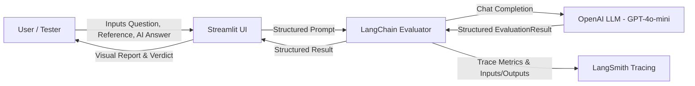

# 🧪 LangSmith Evaluator Agent — Test Case Generator & Error Detection

A lightweight, beginner-friendly AI evaluation and test case generation tool built with **Python**, **LangChain**, **Google Gemini / OpenAI**, **Streamlit**, and **LangSmith**.

This application generates **5–7 diverse test cases with pinpoint error locations** from any Question & Expected Answer, and acts as an **LLM-as-a-Judge** to evaluate AI answers against reference ground truth with full observability in **LangSmith**.

---

## 📌 Project Features

1. **Simple 2-Input Frontend**: Enter a **Question** and an **Expected Answer**, then click **🚀 Generate Test Cases**.
2. **Automated 5–7 Test Case Generation**: Produces a rich mixture of:
   - ✅ Correct Answer (`PASS`)
   - 🔄 Correct Paraphrased Answer (`PASS`)
   - ⚠️ Partially Correct Answer (`PARTIAL`)
   - 📉 Incomplete Answer (`PARTIAL`)
   - ❌ Incorrect Answer (`FAIL`)
   - 🚫 Irrelevant Answer (`FAIL`)
   - 🎭 Misleading Answer (`FAIL`)
3. **Pinpoint Error Location Detection**: Identifies the exact phrase, sentence, or missing concept where the flaw occurs (and explicitly marks `"No error."` for accurate answers).
4. **Interactive In-Card Evaluation**: Click **🚀 Evaluate** inside any test case card to evaluate the response against the rubric, detect error locations, and verify verdict alignment.
5. **Full Observability with LangSmith**: Traces prompt inputs, model outputs, token usage, latency, and errors without manual logging.

---

## 🏗️ Architecture & Workflow



### Evaluation Rubric:
- **Correctness**: Does the AI answer present the same factual truths as the reference answer? (Semantic equivalence is honored).
- **Relevance**: Does the response directly address the question that was asked?
- **Faithfulness**: Does the response remain grounded in the reference facts without hallucinating external, conflicting, or unverified claims?

---

## 📂 Project Structure

```text
LangSmith-Evaluator-Agent/
├── app.py              # Streamlit application & LangChain evaluator chain
├── requirements.txt    # Project dependencies
├── .env.example        # Example environment variable template
├── .env                # Local environment variables (ignored by git)
├── .gitignore          # Git ignore rules for secrets and virtualenvs
├── README.md           # Project documentation and guide
└── data/
    └── spring_boot_test_cases.json  # Ground-truth test dataset from Spring Boot notes
```

---

## 📚 Spring Boot Predefined Test Dataset

The application includes a predefined dataset of **10 Spring Boot Test Cases** with reference answers:

### 🟢 5 Easy Questions (TC-001 to TC-005)
- **TC-001**: What is Spring Boot? (`Spring Boot Fundamentals`)
- **TC-002**: What is the purpose of the `@SpringBootApplication` annotation? (`Annotations`)
- **TC-003**: What are Spring Boot Starter dependencies? (`Starters & Dependency Management`)
- **TC-004**: What is Spring Boot auto-configuration? (`Auto-Configuration`)
- **TC-005**: What is an embedded server in Spring Boot? (`Embedded Servers`)

### 🔴 5 Very Complex Questions (TC-006 to TC-010)
- **TC-006**: How auto-configuration works, conditional annotations, and overriding automatically configured beans. (`Advanced Auto-Configuration & Conditions`)
- **TC-007**: Dependency injection, bean creation, component scanning, `@Bean`, bean scopes, and `ApplicationContext`. (`IoC Container & Bean Lifecycle`)
- **TC-008**: Multi-environment database configuration with profiles and property precedence. (`Externalized Configuration & Profiles`)
- **TC-009**: End-to-end REST request processing (`DispatcherServlet`, `@RestController`, Service, Repository, `@ControllerAdvice`). (`REST Architecture & DispatcherServlet`)
- **TC-010**: Declarative transactions with `@Transactional`, boundaries, rollback rules, propagation, and self-invocation proxy limitations. (`Declarative Transaction Management`)

Each test case contains:
1. **ID, Topic, Difficulty**: Clear categorization and difficulty levels.
2. **Question**: Explicit technical prompt.
3. **Reference Answer**: Comprehensive ground truth.
4. **Sample Answers**: Predefined responses for testing `PASS`, `PARTIAL`, and `FAIL` scenarios.

---

## 📋 Prerequisites

- **Python 3.10+** (Python 3.11 recommended)
- **Google Gemini API Key** (from [Google AI Studio](https://aistudio.google.com/)) or **OpenAI API Key** (from [OpenAI Platform](https://platform.openai.com/))
- **LangSmith Account & API Key** (free account available at [smith.langchain.com](https://smith.langchain.com/))

---

## 🚀 Setup & Installation

### Step 1: Clone or Navigate to the Project Directory
```powershell
cd "c:\Users\Hariharan K\OneDrive\Desktop\LangSmith-Evaluator-Agent"
```

### Step 2: Create and Activate a Virtual Environment

**On Windows (PowerShell):**
```powershell
python -m venv .venv
.\.venv\Scripts\Activate.ps1
```

*(If script execution is disabled on PowerShell, run `Set-ExecutionPolicy -Scope Process -ExecutionPolicy Bypass` first)*

**On macOS/Linux:**
```bash
python3 -m venv .venv
source .venv/bin/activate
```

### Step 3: Install Dependencies
```powershell
pip install -r requirements.txt
```

---

## ⚙️ Environment Configuration

1. Make sure your `.env` file exists (or copy `.env.example` to `.env`):
   ```powershell
   cp .env.example .env
   ```

2. Open `.env` and fill in your keys:
   ```ini
   # LangSmith Observability Configuration
   LANGSMITH_TRACING=true
   LANGSMITH_ENDPOINT=https://api.smith.langchain.com
   LANGSMITH_API_KEY=lsv2_pt_your_langsmith_api_key_here
   LANGSMITH_PROJECT=LangSmith-Evaluator-Agent

   # OpenAI API Configuration
   OPENAI_API_KEY=sk-your_openai_api_key_here
   ```

> 🔒 **Security Note**: Never commit your `.env` file or expose your API keys in public repositories. `.env` is already configured in `.gitignore`.

---

## 🖥️ Running the Application

Launch the Streamlit app:
```powershell
streamlit run app.py
```

Open your browser at `http://localhost:8501` to use the interface.

---

## 🧪 Running the Deliberate Evaluator Error Tests

To verify that the evaluator accurately identifies errors across deliberate correct, wrong, incomplete, irrelevant, and misleading answers without needing the browser:

```powershell
.\.venv\Scripts\python.exe test_evaluator_errors.py
```

This test runner executes 7 deliberate test cases:
1. `CORRECT` — Expects `PASS`, no error location.
2. `CORRECT_EXPLANATION` — Expects `PASS`, no error location.
3. `WRONG_OUTPUT` — Expects `FAIL`, identifies incorrect numerical output.
4. `WRONG_OPERATOR` — Expects `FAIL`, identifies incorrect output & operator claim.
5. `INCOMPLETE` — Expects `PARTIAL` / `FAIL`, identifies missing output value.
6. `IRRELEVANT` — Expects `FAIL`, identifies off-topic answer.
7. `MISLEADING` — Expects `FAIL` / `PARTIAL`, identifies false syntax error claim.

---

## 🔍 How LangSmith Tracing Works

When you run an evaluation in the app:
1. `LANGSMITH_TRACING=true` automatically instructs LangChain to log the lifecycle of the LLM call.
2. The trace is tagged with project metadata (`LangSmith-Evaluator-Agent`, `evaluator_type="LLM_as_a_judge"`).
3. **To view your traces:**
   - Go to [smith.langchain.com](https://smith.langchain.com/).
   - Click on **Projects** in the left sidebar.
   - Select **`LangSmith-Evaluator-Agent`**.
   - Click on the latest run named `Evaluate_AI_Answer` to inspect:
     - Exact rendered prompt sent to the LLM
     - Parsed structured output JSON
     - Latency / execution duration
     - Token count and cost estimates
     - Any runtime errors or warnings

---

## 🛠️ Common Errors & Troubleshooting

| Issue | Cause | Solution |
|---|---|---|
| `AuthenticationError: Incorrect API key provided` | Invalid or missing `OPENAI_API_KEY` | Check `.env` or input a valid OpenAI API key in the Streamlit sidebar. |
| Traces not appearing in LangSmith | `LANGSMITH_API_KEY` is missing or invalid | Ensure `LANGSMITH_API_KEY` starts with `lsv2_...` and is saved in `.env` or entered in the sidebar. |
| `ModuleNotFoundError: No module named 'langchain'` | Virtual environment not activated or dependencies not installed | Run `.\.venv\Scripts\Activate.ps1` and `pip install -r requirements.txt`. |
| Script Execution Disabled in PowerShell | Windows PowerShell restriction policy | Run `Set-ExecutionPolicy -Scope Process -ExecutionPolicy Bypass` and reactivate `.venv`. |

---

## ⚠️ Disclaimer
LLM-based evaluation is an automated estimate and can make mistakes. For high-stakes production applications, use LLM evaluation alongside automated test suites and human-in-the-loop review.
